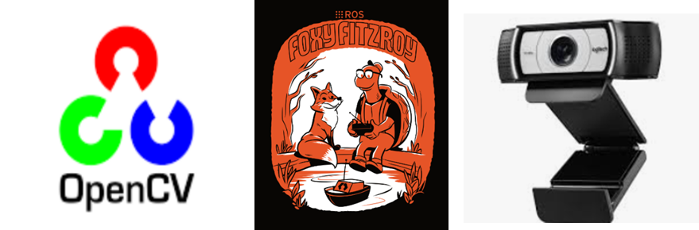

# Project Explanation  

In this project, I would like to create a prototype of a system that can apply image conversion technology to dynamic situations such as the driving environment of a car.  
  
  
The configuration of the system is as follows: It consists of a laptop using Ubuntu 20.04 OS and two webcams running with ros2 foxy    
Implement two webcams using Ros2's usb_cam package and receive video streams as input.  
The input image frames are transmitted to the image conversion node in the computer through the ros topic, and the converted image is visualized.  
[BEV System config](./demo/image(4).png)  
.png)  

[Image_Stitching System config](./demo/image(5).png)  
  